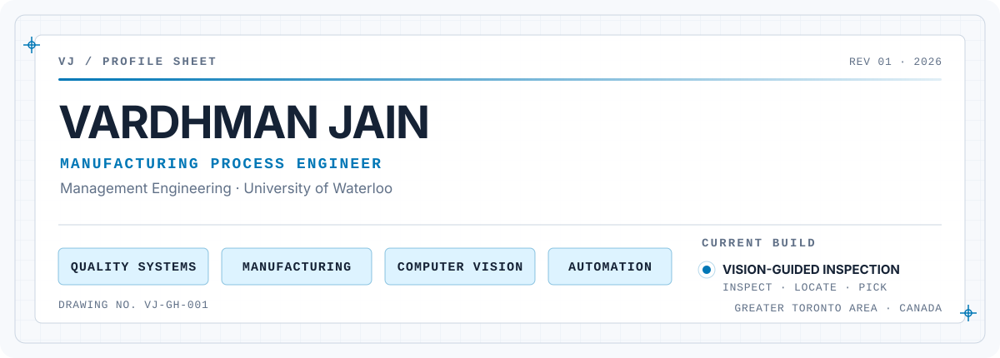
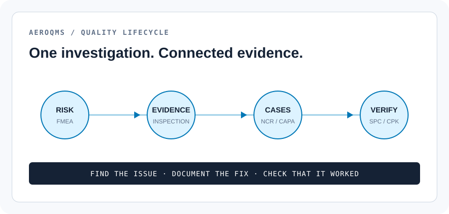
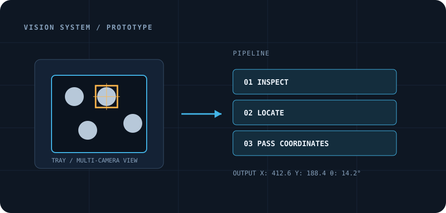

  

I'm a Management Engineering graduate from the University of Waterloo, currently working in manufacturing.

Most of what I build here starts with something I want to figure out, usually around quality, computer vision, manufacturing, or automation.

 

## SELECTED WORK

<table>
  <tr>
    <td width="56%">
      
    </td>
    <td width="44%" valign="top">
      01 / QUALITY ENGINEERING CASE STUDY
      <h3>How much real defect data does AI inspection actually need?</h3>
      
I trained 45 ResNet18 classifiers on different mixes of real and synthetic manufacturing defects. Synthetic data made the inspector more cautious: fewer escapes in some conditions, but more good parts rejected.

      
<code>PyTorch</code> <code>ResNet18</code> <code>Synthetic Data</code>

      <a href="https://github.com/vjsiddha/AI-Defect-Data-Sufficiency-Study"><strong>View the study →</strong></a>
    </td>
  </tr>
</table>

<table>
  <tr>
    <td width="44%" valign="top">
      02 / QUALITY SYSTEM
      <h3>AeroQMS — Quality Detective</h3>
      
I wanted to see what a quality system would look like if its different pieces actually talked to each other. AeroQMS connects FMEA, inspection evidence, NCR/CAPA investigations, supplier feedback, SPC, and effectiveness checks.

      
<code>Python</code> <code>Streamlit</code> <code>SQLite</code> <code>SPC</code>

      <a href="https://github.com/vjsiddha/AeroQMS-Quality-Detective"><strong>Explore AeroQMS →</strong></a>
    </td>
    <td width="56%">
      
    </td>
  </tr>
</table>

<table>
  <tr>
    <td width="56%">
      
    </td>
    <td width="44%" valign="top">
      03 / CURRENTLY BUILDING
      <h3>Vision-Guided Inspection &amp; Picking</h3>
      
A prototype for inspecting trays of parts, identifying defects and part position, and producing coordinates a robotic picking system can use.

      
<code>Computer Vision</code> <code>OpenCV</code> <code>Robotics</code>

      
<strong>Repository coming as the prototype develops.</strong>

    </td>
  </tr>
</table>
